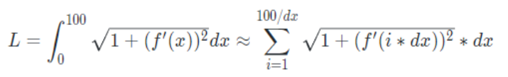
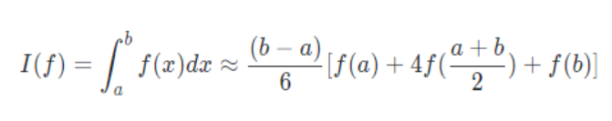

### 1.6 wyh曲线求长度

#### 问题描述

给你三组数列，分别为

k1 k2 ... kn

a1 a2 ... an

b1 b2 ... bn

现在给你一个式子：

![F[x] min](function1.png)

然后我们可以将这个函数画在一个xoy直角坐标系下，x的范围为[0,100]，当然我们可以得到一条曲线，求出这个曲线的长度，结果保留两位小数

#### 思路步骤

1. 使用高数积分知识

提高精度就是降低dx的取值，同时需要保证时间复杂度，所以dx不能太小。

2. 仅使用此公式精度不足以达到要求，所以考虑使用Simpson公式

3. 公式组成实际上是直线和很多条抛物线组成。
所以最后的图像当中很可能存在直线或者比较平滑的曲线，对于这部分曲线没有必要划分的很细进行计算。
所以采用自适应的想法来计算。

4. 所以条件设计为

如果划分之后对于精度提升帮助不大

或者该段曲线已经比较短

否则就对于曲线进行划分，等分成两端，分别继续处理。

#### 重点问题和解决方法

1. 设定精度

在1e-6  0.00001

2. 设定dep 以10为界限，作为dx的大小临界
