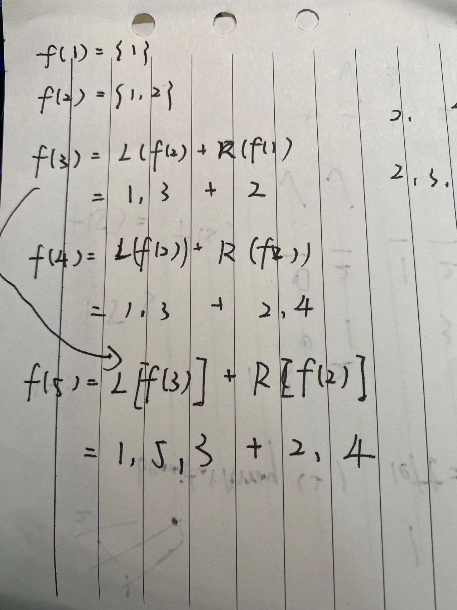

### 1.8 漂亮数组

#### 问题描述

对于某些固定的 N，如果数组 A 是整数 1, 2, ..., N 组成的排列，使得：

对于每个 i < j，都不存在 k 满足 i < k < j 使得 A[k] * 2 = A[i] + A[j]。

那么数组 A 是漂亮数组。

给定 N，返回任意漂亮数组 A（保证存在一个）。

#### 思路步骤

1. 数组是由自然数构成的，1，2，3，...,N

2. 性质1  偶数 + 奇数 ！= 偶数

3. 性质2  如果{ X, Y, Z }是一个漂亮数组，则{ k*X+b, k*Y+b, k*Z+b } 也
一定是漂亮数组

4. 等分为两部分，left和right， 如果left部分是漂亮数组，right部分也是漂亮数组， 同时left部分全部是奇数，right部分全部是偶数，那么此时left + right组成的数组一定也是一个漂亮数组

5.
N = 1 时，漂亮数组为 [1]

N = 2 时，通过N = 1变换。 1 * 2-1 = 1, 1 * 2= 2, 所以漂亮数组为[1,2]

N = 3 时，通过 N = 2 和 N = 1变换得到。 N = 2变换得奇部 2 * 1 - 1 = 1, 2 * 2 - 1 = 3; N = 1变换得到偶部分 2 * 1 = 2。最后漂亮数组为[1, 3, 2]。始终保证奇部在前，偶部在后。

N = 5 时， 通过N=3 和N=2 得到

以下是手写的递归过程  L指 2i-1  R指 2i 函数

